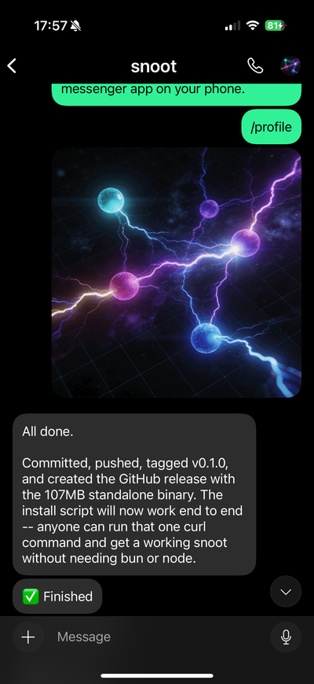
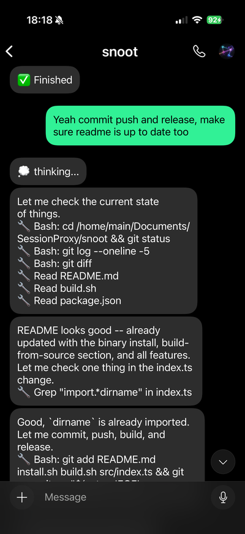

# Snoot

A proxy that bridges encrypted messengers ([Session](https://getsession.org) or [Matrix](https://matrix.org)) with AI coding assistants, letting you chat with Claude or Gemini about your codebase from your phone.

Messages flow: **Messenger app** → **Snoot proxy** → **Claude/Gemini process** → **back to messenger**.

<table align="center">
  <tr>
    <td align="center"></td>
    <td align="center"></td>
  </tr>
</table>

## How It Works

Snoot uses an ephemeral per-message model — each message (or batch of rapid messages) spawns a fresh AI process, gets a response, and exits. The proxy owns all conversation state and manages context compaction between requests.

- When a message arrives, Snoot builds a context prompt (summary + pins + recent history) and spawns a new process.
- Multiple messages sent in quick succession are batched into a single request.
- For long-running requests, partial responses stream back every 30 seconds, including tool call activity so you can see what the AI is doing.
- Responses containing inline SVG diagrams are automatically converted to PNG images and sent through Session.
- When the AI finishes, you get a "Finished" confirmation.

## Requirements

- [Claude Code CLI](https://docs.anthropic.com/en/docs/claude-code) installed and on PATH
- [Gemini CLI](https://github.com/google-gemini/gemini-cli) installed and on PATH (optional, for Gemini backend)
- A messenger app: [Session](https://getsession.org) or a [Matrix](https://matrix.org) client (e.g. [Element](https://element.io))
- Linux x86_64 or Windows x86_64 (pre-built binaries)

## Install

### Windows

Download `snoot-installer.exe` from the [latest release](https://github.com/brontoguana/snoot/releases/latest) and run it. It installs to `%LOCALAPPDATA%\snoot\`, adds it to your PATH, and includes an uninstaller.

### Linux / macOS

```bash
curl -fsSL https://raw.githubusercontent.com/brontoguana/snoot/main/install.sh | bash
```

This downloads a standalone binary to `~/.local/bin/snoot` — no runtime dependencies needed.

### Setup

Configure your transport and user ID:

```bash
# Session transport
snoot setup session 05abc123...

# Matrix transport
snoot setup matrix @me:myserver.org --homeserver https://myserver.org --token syt_...
# or login interactively:
snoot setup matrix @me:myserver.org --homeserver https://myserver.org
```

This saves to `~/.snoot/config.json` and is used for all projects unless overridden with `--user`. Switching transport automatically restarts all running instances.

## Usage

```
snoot <channel> [options]
snoot setup session <session-id>
snoot setup matrix <@user:server> [--homeserver <url>] [--token <token>]
snoot watch <channel>
snoot shutdown [channel]
snoot restart [channel]
snoot ps
snoot cron
snoot nocron
```

### Starting a channel

```bash
# Start snoot (runs in background, logs to .snoot/<channel>/snoot.log)
snoot mychannel

# With options
snoot mychannel --mode research --backend gemini

# Run in foreground (for debugging)
snoot mychannel --fg

# Override user for this project
snoot mychannel --user 05def456...
```

Run this from the project directory you want the AI to work on. Snoot daemonizes by default — it verifies startup, then detaches and logs to `.snoot/<channel>/snoot.log`.

### Stopping

```bash
# Stop a specific channel
snoot shutdown mychannel

# Stop all running instances
snoot shutdown
```

### Restarting

```bash
# Restart with saved args (works from any directory)
snoot restart mychannel

# Restart all running instances
snoot restart
```

### Watching live activity

```bash
# Follow real-time activity (tool calls, LLM output, messages)
snoot watch mychannel
```

This tails the watch log and shows incoming messages, tool calls, and streaming LLM output. You can also type messages directly in the terminal and press Enter to send them — they're processed identically to messages from your phone.

### Listing instances

```bash
# Show all running instances with PID and project directory
snoot ps
```

### Boot persistence

```bash
# Register all instances to start on boot
snoot cron

# Remove boot entries
snoot nocron
```

On Linux this uses @reboot cron entries. On Windows it creates Task Scheduler logon tasks. Running `snoot cron` multiple times is safe — it skips channels that already have entries. Each instance restarts in its original working directory with its original launch args.

### Options

| Flag | Description | Default |
|------|-------------|---------|
| `--user <id>` | User ID — Session hex or Matrix @user:server (overrides saved) | — |
| `--mode <mode>` | Tool mode: `chat`, `research`, or `coding` | `coding` |
| `--backend <backend>` | AI backend: `claude` or `gemini` | `claude` |
| `--budget <usd>` | Max budget per message in USD | unlimited |
| `--context-budget <n>` | Context budget in tokens before compaction | `100000` |
| `--fg` | Run in foreground instead of daemonizing | off |

Budget can also be set globally in `~/.snoot/config.json`:
```json
{ "budgetUsd": 2.00 }
```

### Modes

- **chat** — No tools. AI can only respond with text.
- **research** — Read-only tools: Read, Grep, Glob, WebSearch, WebFetch.
- **coding** — Full tools: Read, Grep, Glob, Edit, Write, Bash, WebSearch, WebFetch.

## Chat Commands

Send these from your phone in the messenger chat:

| Command | Description |
|---------|-------------|
| `/help` | Show available commands |
| `/boop` or `/update` | Quick status check — is the AI busy? When was it last active? |
| `/status` | Show full state (backend, mode, process status, message count) |
| `/context` | Show summary and pinned items |
| `/mode <mode>` | Switch mode (chat/research/coding) |
| `/claude` | Switch to Claude backend |
| `/gemini` | Switch to Gemini backend |
| `/pin <text>` | Pin context that survives compaction |
| `/unpin <id>` | Remove a pinned item |
| `/profile <description>` | Generate an avatar from a text description |
| `/profile` (with image attached) | Set the attached image as the avatar |
| `/save <name>` (with file attached) | Save attachment to working directory (refuses if file exists) |
| `/overwrite <name>` (with file attached) | Same as `/save` but allows overwriting existing files |
| `/compact` | Force context compaction now |
| `/stop` | Cancel the current request |
| `/restart` | Restart the snoot process |
| `/forget` or `/clear` | Clear all context and start fresh |

## SVG Image Support

When the AI wants to show a table, diagram, chart, or any structured visual, it embeds an inline SVG in its response. Snoot automatically:

1. Detects SVG blocks in the response text.
2. Converts each SVG to a PNG image (800px wide, via resvg-js).
3. Sends the PNG as an image message.
4. Sends surrounding text as separate text messages.

For example, if the AI responds with an explanation, then a diagram, then more explanation — you'll receive three messages: text, image, text.

SVGs are stripped from conversation history (replaced with `[image]`) to save context space.

## Avatar Generation

Two ways to set the Snoot avatar:

**From a description**: Send `/profile a cyberpunk crow` — the AI generates an SVG, Snoot converts it to PNG, and sets it as the profile picture.

**From an image**: Send `/profile` with an image attached — Snoot uses the image directly as the avatar.

The avatar is cached and restored automatically when the instance restarts.

## Context Management

Snoot manages conversation context across ephemeral AI processes:

- **Full-fidelity history** — message pairs include complete tool-use traces (file reads, edits, bash commands), not just text responses. Each new AI process sees exactly what previous processes did.
- **Token-budget compaction** — context is measured in estimated tokens (default 100k). When it exceeds 110% of the budget, only the oldest pairs are summarized by Sonnet and trimmed. The vast majority of history remains intact.
- **Pins** survive compaction, ensuring important context is never lost.
- **Daily archives** (`archive/archive-YYYY-MM-DD.jsonl`) keep a full append-only history with 30-day retention.
- **Summary** (`summary.md`) is a rolling compacted summary fed to each new AI process.

All state lives in `.snoot/<channel>/` within your project directory.

## Progressive Streaming

For requests that take more than 30 seconds, Snoot streams partial responses back to your phone every 30 seconds. Each batch includes both the AI's text output and tool call activity (file reads, edits, searches, etc.) so you can see what it's doing. Short responses are sent all at once. When the AI finishes, you receive a "Finished" confirmation.

## Error Handling

- **Rate limits**: Automatically retries after 30 seconds, up to 5 attempts. Notifies you of each retry.
- **API errors (500)**: Same auto-retry with backoff and notification.
- **Empty responses**: Detects and reports when the AI returns nothing (usually a budget or rate limit issue).

## Building from Source

If you want to modify Snoot or build from source:

```bash
git clone https://github.com/brontoguana/snoot.git
cd snoot
bun install
./build.sh              # produces dist/snoot-linux-x64 and dist/snoot-windows-x64.exe
```

Requires [Bun](https://bun.sh) to build. The build script cross-compiles for both Linux and Windows.

## Project Structure

```
src/
├── index.ts      # CLI entry point, arg parsing, PID lock, daemonization
├── proxy.ts      # Core orchestration, message batching, SVG extraction
├── claude.ts     # Claude process lifecycle, stream-json I/O
├── gemini.ts     # Gemini process lifecycle, stream-json I/O
├── context.ts    # Context store, compaction, prompt building
├── session.ts    # Session transport — identity, send/receive, message chunking
├── matrix.ts     # Matrix transport — login, room management, send/receive
├── commands.ts   # /slash command handler
├── profile.ts    # Avatar generation, SVG-to-PNG conversion
└── types.ts      # Shared types and interfaces (TransportClient, Config, etc.)
```

## License

Private.
